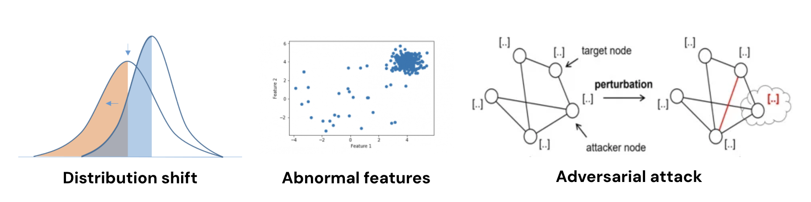
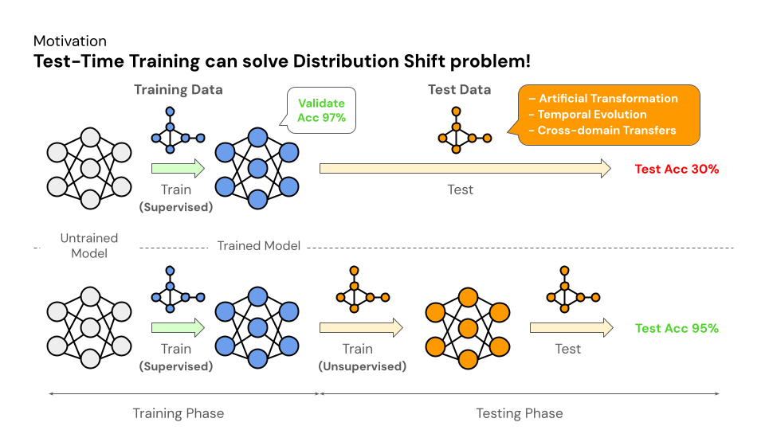
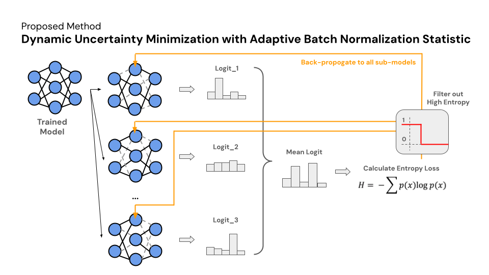
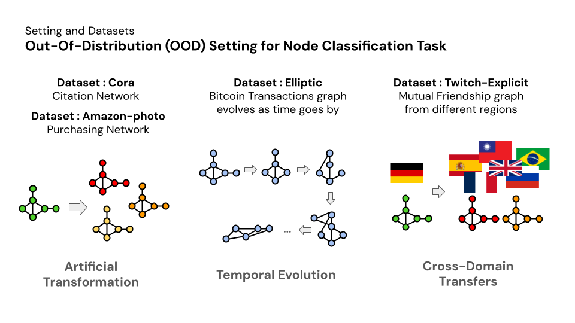
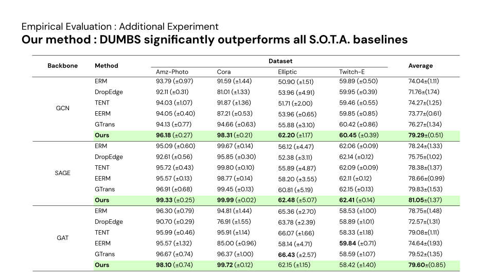

# DUMBS : Dynamic Uncertainty Minimization with Adaptive Batch Normalization Statistic
Pytorch Implementation of **Dynamic Uncertainty Minimization with Adaptive Batch Normalization Statistic**.  
[[`Slides`](https://docs.google.com/presentation/d/1X7cJNbXaqk6-9NBSExkchBZyqPiScSFkYyTh7psmw0U/edit?usp=sharing)]
[[`Poster`](https://github.com/s6007541/DUMBS/blob/main/pdf_files/DUMBS_poster.pdf)] 

> Contributors: Sorn Chottananurak, Settasit Murichan


## Abstract
Graph neural networks (GNNs) demonstrate strong representation learning performance on training and testing data when both are drawn from the same distribution. However, their performance degrades significantly when there is a distribution shift between training and testing data, such as abnormal features and adversarial structure attacks. Traditional approaches suggest using labeled data from both the training and test-time distributions to address this issue. However, this is impractical in real-world scenarios due to privacy concerns and cost. 
<p align="center">

</p>
The data-centric approach to adapt graph data at test time is proposed to improve performance under the domain shift.  However, solely focusing on data adaptation without considering the modeling aspect and batch normalization statistic can lead to suboptimal results. Recognizing this opportunity, we propose a method named DUMBS : Dynamic Uncertainty Minimization with Adaptive Batch Normalization Statistic that concurrently minimize uncertainty of submodels generated from Monte-Carlo dropout inference and optimizing batch normalization statistic during test time. This approach aims to fully leverage all available optimization parameters to better mitigate the effects of domain shift and enhance overall adaptation performance. Remarkably, DUMBS achieves better performance compare to baselines as well as surpasses state-of-the-art method such as GTrans on the majority of dataset used.
<p align="center">


</p>

## Table of Contents

- [Introduction](#introduction)
- [Overview](#overview)
- [Getting Started](#getting-started)
- [Usage](#usage)
- [Results](#results)
- [Conclusion](#conclusion)

## Getting Started

To run this project, you will need the following:

- Gmail for Google Colab registration
- Google Drive space for storing datasets

## Usage

1. Clone the repository:

```bash
git clone https://github.com/s6007541/DUMBS.git
```

2. Download `params.csv` and all datasets from the following Google Drive link: https://drive.google.com/drive/folders/1-Q0fdugxlWb1n5dkeiGfe_TR9czBEx2i?usp=drive_link

3. Upload `DUMBS.ipynb`, `params.csv`, and all datasets to your Google Drive account.

4. Open `DUMBS.ipynb` in Google Colab and follow the instructions provided in the file.

## Dataset Detail
We use a diverse set of datasets to evaluate the performance of their proposed method in out-of-distribution (OOD) node classification. These datasets represent various challenges in OOD scenarios:

1. Cora: This citation network dataset simulates an artificial transformation, where nodes and edges are randomly modified.
2. Elliptic: This Bitcoin transactions graph evolves over time, capturing temporal changes in network structure and node attributes.
3. Twitch-Explicit: This mutual friendship graph from different regions presents cross-domain transfers, where the model needs to generalize to unseen domains.
4. Amazon-photo: This purchasing network dataset involves a combination of artificial transformation, temporal evolution, and cross-domain transfers.
By evaluating on these diverse datasets, the DUMBS paper demonstrates its robustness and adaptability to different OOD challenges.

<p align="center">

</p>

## Results
We evaluate DUMBS on four datasets, comparing it against five state-of-the-art baselines across three graph-based architectures: GCN, SAGE, and GAT. DUMBS consistently achieves the best performance, establishing it as the state-of-the-art method.
<p align="center">

</p>

## Conclusion
GNNs tend to yield unsatisfying performance when the presented data is sub-optimal. While approaches like GTrans that focus on data adaptation at test time can lead to a better performance on distribution shift data, solely prioritizing this aspect can lead to sub-optimal outcomes. To address this, we propose DUMBS: Dynamic Uncertainty Minimization with Adaptive Batch Normalization Statistic that concurrently minimizes the uncertainty of submodels generated from Monte Carlo dropout inference and optimizes batch normalization statistics during test time. Experimental results on out-of-distribution (OOD) dataset for node classification task have demonstrated the effectiveness of our method. DUMBS outperforming various state-of-the-art method in GCN baseline as well as achieving generalization in SAGE and GAT architecture.